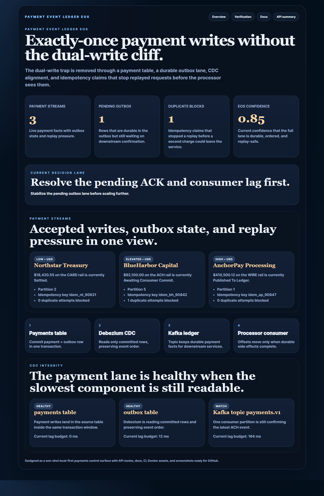
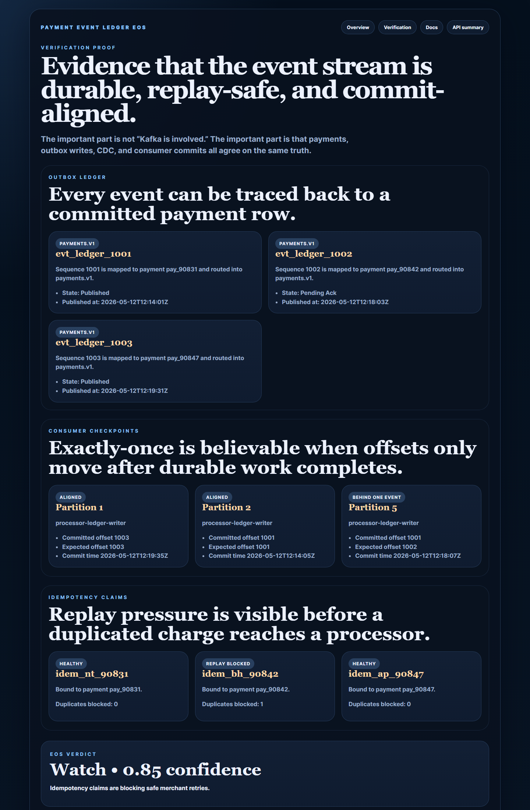
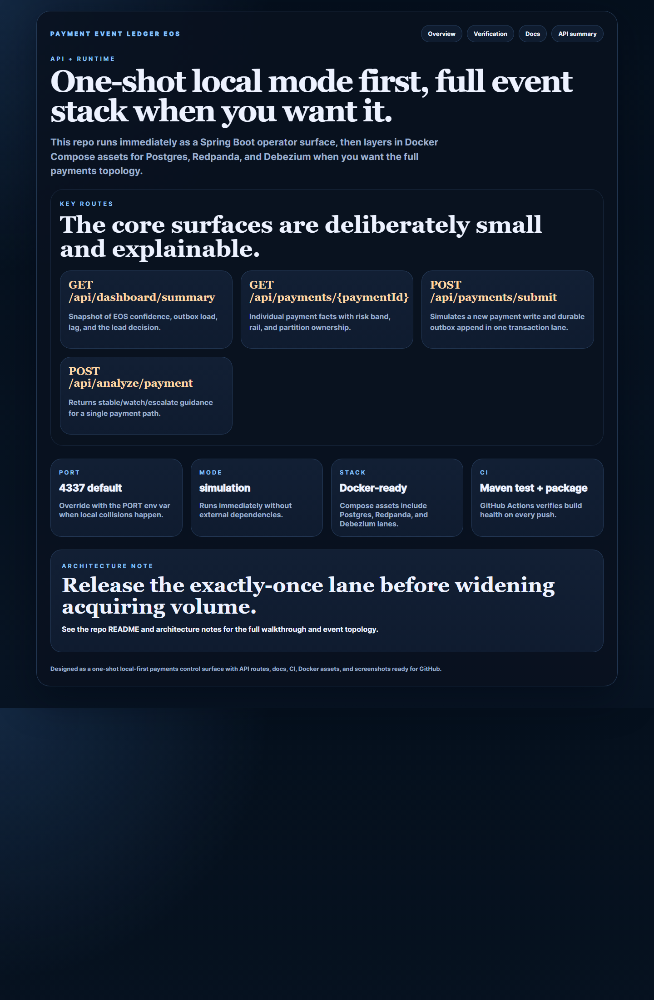
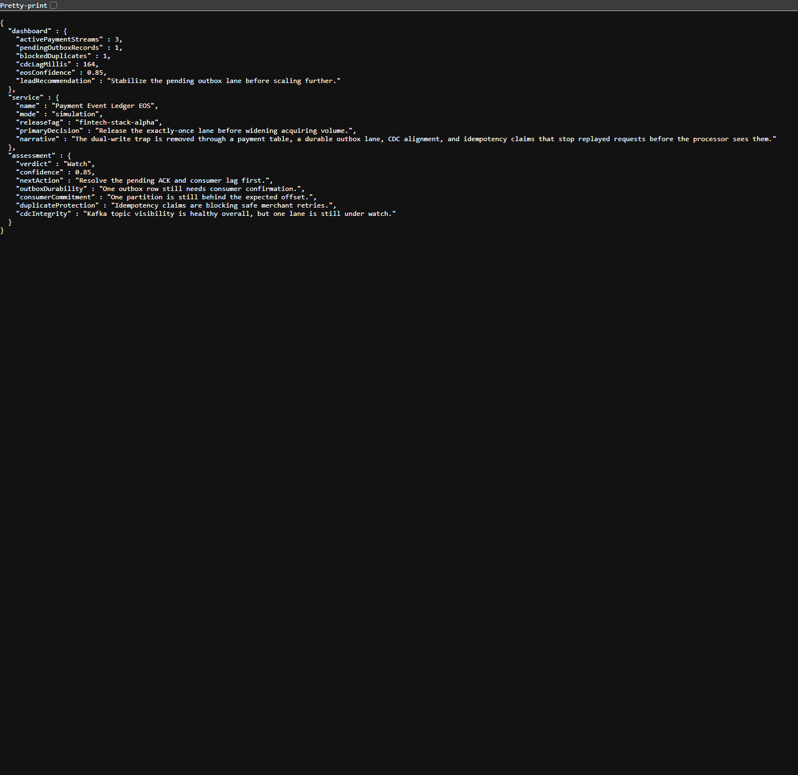

# Payment Event Ledger EOS

Exactly-once payments backend that demonstrates the outbox pattern, CDC alignment, consumer checkpointing, and idempotency tracking without making local startup painful.

## Why this repo is good

- It targets a real fintech/platform problem instead of another generic API.
- It shows how to talk about **payment correctness**, not just Kafka buzzwords.
- It makes the dual-write problem visible through a payment lane, durable outbox records, and checkpoint evidence.
- It runs immediately in local simulation mode, then layers in `docker-compose` assets for `Postgres + Redpanda + Debezium`.

## Screenshots






## What it includes

- Spring Boot 3.5 / Java 21 service
- Operator-style HTML control surface at `/`
- JSON APIs for summary, payments, outbox, and analysis
- Local-first sample ledger
- Idempotency claim tracking and duplicate-blocking demo
- Dockerfile and Docker Compose
- GitHub Actions CI
- Architecture notes in [docs/architecture.md](./docs/architecture.md)

## Local run

```powershell
Set-Location "C:\Users\chaus\dev\repos\payment-event-ledger-eos"
$env:JAVA_HOME = "C:\Program Files\Microsoft\jdk-21.0.11.10-hotspot"
$env:Path = "$env:JAVA_HOME\bin;$env:Path"
.\mvnw.cmd spring-boot:run
```

Open:

- `http://127.0.0.1:4337/`
- `http://127.0.0.1:4337/verification`
- `http://127.0.0.1:4337/docs`

If the port is busy:

```powershell
$env:PORT = "4341"
.\mvnw.cmd spring-boot:run
```

## Verification

```powershell
.\mvnw.cmd test
.\mvnw.cmd package
```

Key routes:

- `GET /api/dashboard/summary`
- `GET /api/payments/pay_90842`
- `GET /api/outbox`
- `GET /api/eos-verification`
- `POST /api/payments/submit`
- `POST /api/analyze/payment`

## Example payment analysis

```json
POST /api/analyze/payment
{
  "paymentId": "pay_90842"
}
```

Returns a `Stable`, `Watch`, or `Escalate` verdict plus the exact blockers still keeping the lane from broader rollout.

## Full event-stack assets

The app runs fine on its own, but the repo also ships with a fuller event-stack story:

```powershell
docker compose --profile event-stack up --build
```

That profile adds:

- `postgres`
- `redpanda`
- `debezium/connect`

## Repo anatomy

- [src/main/java/com/mizcausevic/paymenteventledgereos/controllers/PageController.java](./src/main/java/com/mizcausevic/paymenteventledgereos/controllers/PageController.java)
- [src/main/java/com/mizcausevic/paymenteventledgereos/controllers/LedgerController.java](./src/main/java/com/mizcausevic/paymenteventledgereos/controllers/LedgerController.java)
- [src/main/java/com/mizcausevic/paymenteventledgereos/services/LedgerService.java](./src/main/java/com/mizcausevic/paymenteventledgereos/services/LedgerService.java)
- [src/main/java/com/mizcausevic/paymenteventledgereos/data/SampleLedgerData.java](./src/main/java/com/mizcausevic/paymenteventledgereos/data/SampleLedgerData.java)
- [docker-compose.yml](./docker-compose.yml)
- [docs/architecture.md](./docs/architecture.md)
